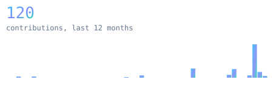
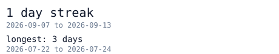
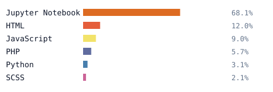
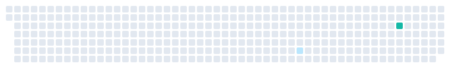

 

# Hi, I'm Ankesh Phapale 👋

<blockquote>
AI Data engineer building reliable data pipelines, analytics, and useful systems.
</blockquote>

<samp>PySpark · Scala · Delta Lake · Kafka · Databricks · Oracle Cloud AIDP</samp>

  

🌱 Currently exploring scalable data engineering, cloud platforms, and applied AI.

📫 Find me on [GitHub](https://github.com/AnkeshPhapale).

  

 
 
 

  

Generated inside this repository by a scheduled action. Zero third-party requests.
